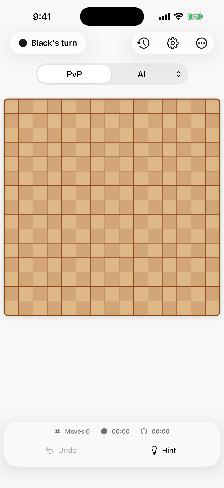
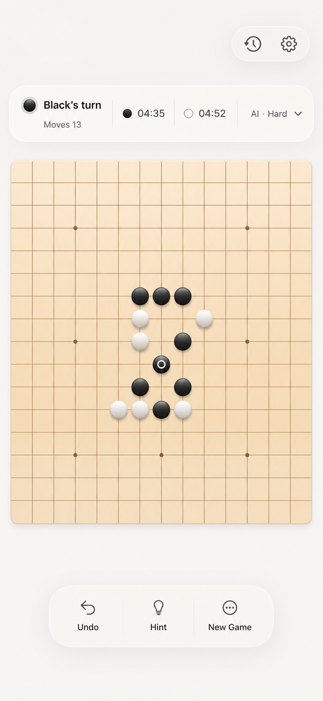
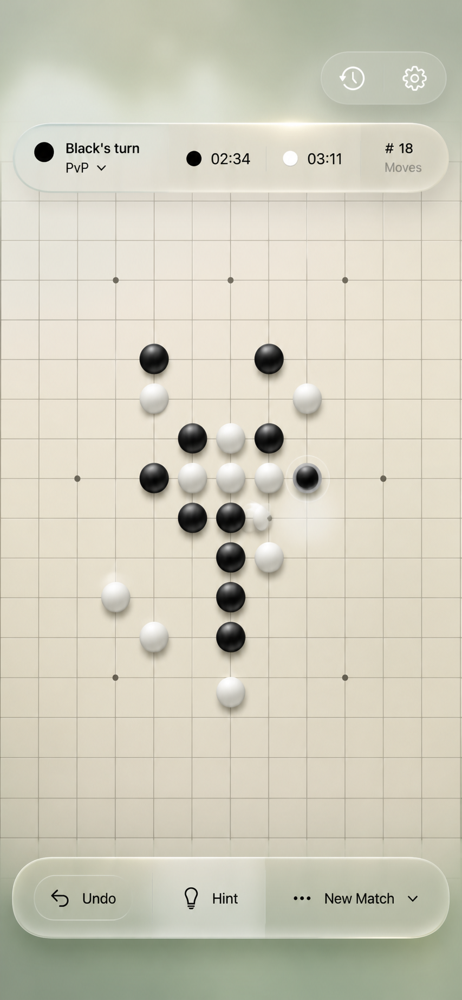
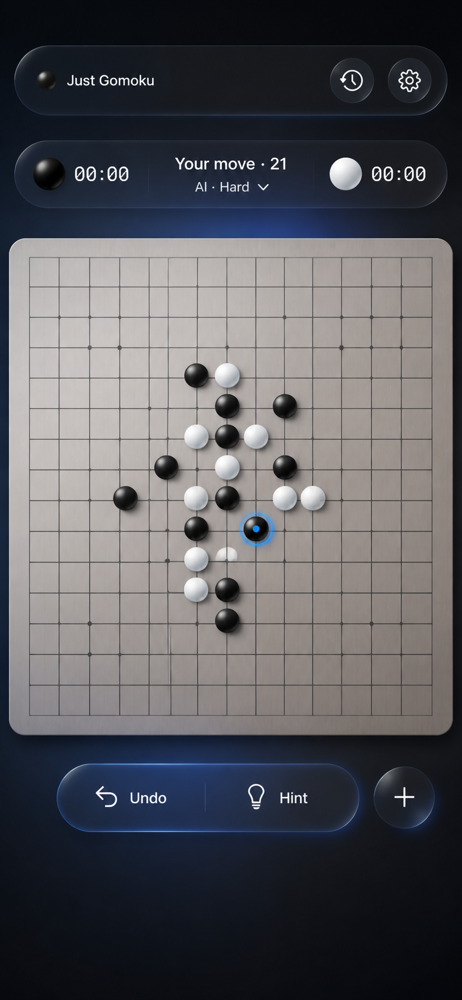
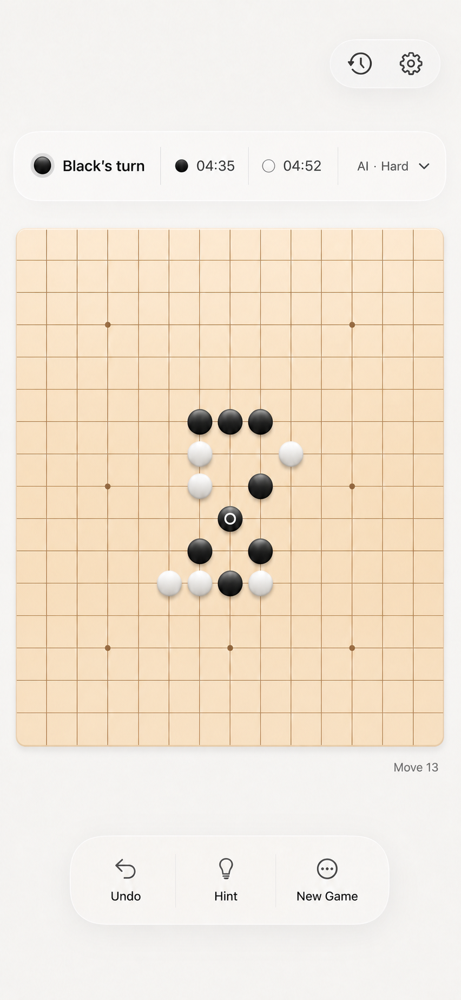

# Just Gomoku — Gameplay UI Audit

Date: August 26, 2026  
Surface: iPhone 17 Pro Max, iOS 26.5, light appearance  
Scope: primary gameplay screen at the start of a match

## Overall verdict

The app already has a strong board-first structure, clear native controls, and a sound iOS 26 Liquid Glass compatibility layer. The main opportunity is subtraction: the current screen has too many independent control islands, while the warm checkerboard visually reads closer to chess than Gomoku. A quieter intersection board, one compact match HUD, and one contextual action island would feel more focused and more distinctly modern.

## Audited step

1. **Open the primary gameplay screen — generally healthy, visually over-articulated.** The game is immediately playable and the board is unmistakably primary. However, status, navigation, mode selection, match metrics, and actions are distributed across four separate chrome zones. The large blank band below the board further disconnects the board from its controls.

## Strengths

- Immediate entry into play with no onboarding wall.
- Large, high-confidence board target with a clear turn indicator.
- Native SF Symbols and semantic type styles fit the platform.
- Bottom actions are reachable and preserve 44-point minimum targets.
- The implementation already uses native iOS 26 glass effects with material fallbacks.
- Board input includes keyboard and named accessibility actions, announcements, haptics, and a precision loupe for dense boards.

## UX risks

1. **Chrome competes with play.** The status pill, toolbar cluster, mode capsule, and bottom dock all carry similar visual weight.
2. **Match state is fragmented.** Turn status sits at the top while move count and clocks sit at the bottom, forcing unnecessary scanning.
3. **Setup controls remain prominent during play.** Mode and AI difficulty are important before a match, but become secondary once stones are on the board.
4. **The board language is off-category.** Alternating squares and cell-centered stones evoke chess or checkers; Gomoku is more naturally expressed with stones on the intersections of a uniform grid.
5. **The glass has little visual context.** Most glass surfaces float over plain white, so they read as opaque white pills rather than refractive material.
6. **The vertical rhythm breaks on tall phones.** The board ends high while the dock is pinned low, leaving a large inactive gulf.

## Accessibility risks

- Fixed-height, single-line controls may not reflow cleanly at large Dynamic Type sizes.
- Essential clock values are allowed to shrink to 72% rather than wrap or change layout.
- White stones depend on a subtle one-point border for separation from the light board.
- The hint is communicated primarily through a thin red ring; it should also use shape, motion, or a clear label.
- Screenshot inspection cannot verify VoiceOver order, switch control, motion preferences, or full Dynamic Type behavior.

## Redesign principles

1. Keep the board as the only opaque, materially distinct surface.
2. Replace the checkerboard with a calm, single-tone intersection grid and recognizable star points.
3. Combine turn, player clocks, and move count into one compact match HUD adjacent to the board.
4. Collapse setup controls after the first move; expose mode, difficulty, and board size through New Game or a compact menu.
5. Use at most two glass families on the gameplay screen: one navigation/status cluster and one contextual action island.
6. Let glass overlap meaningful color or texture so translucency is perceptible.
7. Reflow essential content for large text instead of scaling it down.

## Evidence limits

This audit covers the freshly captured primary screen and current SwiftUI implementation. It does not claim full WCAG conformance and does not cover History, Settings, game-over, dark mode, iPad, or macOS in this pass.

## Concept renders

### Selected revision

