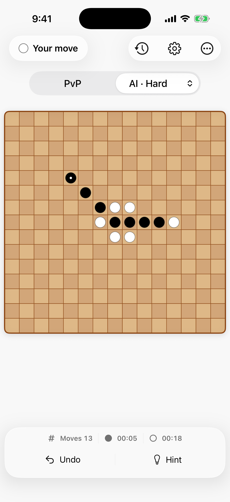

# Just Gomoku — Main Gameplay UI Audit

Date: 2026-08-26

## Audit scope

- Surface: iPhone primary gameplay screen
- Device: iPhone 17 Pro simulator, iOS 26.5, light appearance
- Captured state: AI / Hard, active match, 13 moves, human turn
- User goal: understand the match state and place the next stone with minimal distraction
- Accessibility target: clear visual hierarchy, 44-point controls, strong contrast, and Dynamic Type support

## Evidence

## Step 1 — Read the match and make the next move

Health: functional and visually clean, but the interface chrome competes with the playfield.

### Strengths

- The board is the largest object and the current stones are immediately legible.
- Turn status is explicit, with a stone indicator and plain-language copy.
- History, Settings, Undo, and Hint use familiar SF Symbols and generous touch areas.
- The bottom dock keeps frequent actions within easy thumb reach.

### UX risks

- Status, navigation, mode, metrics, and actions form four separate floating surfaces. The repeated glass treatment fragments the screen instead of creating one calm hierarchy.
- The full-width mode selector remains visually prominent during active play, even though switching opponent or difficulty is a setup action rather than the next action.
- Large unused space between the board and dock makes the board and controls feel disconnected.
- The alternating board squares add visual noise and read more like a checkerboard than a traditional intersection-based Gomoku board.
- Match state is split across the top status chip and bottom metrics, so the eye travels the full screen to understand turn, move count, and clocks.

### Accessibility risks

- The automated Xcode accessibility audit failed with `Dynamic Type font sizes are partially unsupported`.
- Several single-line controls and the compressed clock row are likely to shrink or truncate instead of reflowing at larger text sizes.
- White stones rely on a thin outline against a light wood board; high-contrast and low-vision states need direct verification.
- A screenshot cannot confirm VoiceOver order, Switch Control behavior, Reduce Motion handling, or contrast ratios.

## Redesign recommendations

1. Use Liquid Glass selectively: one navigation cluster and one action surface are enough.
2. Demote game mode and difficulty after a match begins; expose them through one compact chip or a setup sheet.
3. Keep turn, move count, and clocks in one compact match-status region close to the board.
4. Replace alternating squares with a quieter uniform board and an intersection grid; preserve strong black/white stone contrast and a clear last-move mark.
5. Let large text reflow into two rows rather than scaling typography down.
6. Center the board within a tighter vertical rhythm so every surface feels connected to play.

## Verification limits

This is a bounded audit of the primary gameplay screen. Settings, history, end-of-game sharing, dark mode, VoiceOver navigation, and large-text screenshots were not captured in this pass.
